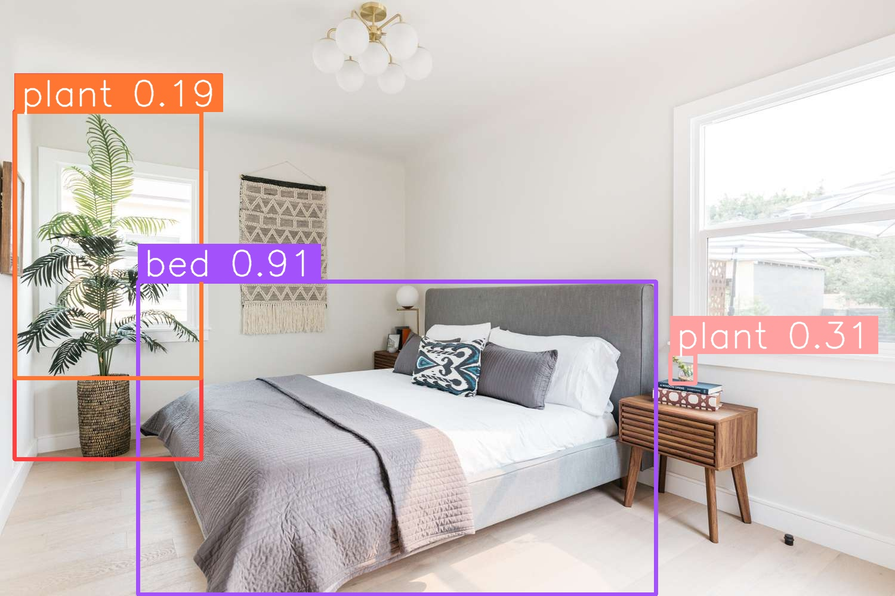

# AI Prompt Image Analyser by Filip Ilovsky

This project is an advanced AI vision tool that leverages GroundingDINO for open vocabulary object detection. Unlike traditional models restricted to fixed class lists, this project allows users to input natural language prompts (e.g., “dog, laptop, artwork”) and dynamically detect those objects in any image.

Detected regions are highlighted with bounding boxes, annotated, and automatically saved for review. The pipeline is built with PyTorch and OpenCV, supporting multiple model backbones (SwinT, SwinB, SwinL) to balance accuracy and performance. Outputs are neatly organised into a dedicated folder, and detection thresholds can be tuned to trade off between precision and recall.

With organized input/output handling and customizable detection thresholds, the system provides a flexible solution for research, dataset generation, and real-world image analysis across virtually unlimited object categories.


## ✨ Features
- Built with PyTorch + OpenCV – reliable, widely supported libraries
- Detect objects in any image with text prompts
- No fixed class list, meaning it detects anything you can describe
- Supports multiple backbones:
  - SwinT (Tiny) → fast, lighter
  - SwinB (Base) → balanced
  - SwinL (Large) → most accurate
- Results saved automatically as `[filename]_output.jpg` into `images/outputs/`


## 🎥 Demo

### Input:


### Prompt:

```bash
bed, plant
```

### Output:




## 🚀 Setup

If you have any problems scroll down to `⚠️ Notes`

1. Clone this repository:
   ```bash
   git clone https://github.com/Filip-2002/AI-prompt-image-analyser.git
   cd AI-prompt-image-analyser


2. Create and activate a virtual environment:

   Windows

   ```bash
   python -m venv .venv
   .\.venv\Scripts\activate
   ```

   MacOS/Linux

   ```bash
   python3 -m venv .venv
   source .venv/bin/activate
   ```


3. Install dependencies:
   ```bash
   pip install -r requirements.txt


4. Download model weights:

   The default backbone is **SwinB (Base)**.  
   Download the weight and place it inside the `weights/` folder:
   
   ```bash
   https://github.com/IDEA-Research/GroundingDINO/releases/download/v0.1.0-alpha2/groundingdino_swinb_cogcoor.pth
   ```

   - If you are having trouble running the Base model you can download SwinT (smallest, least accurate, fast).
   - If your machine is powerful and can handle a bigger model you can download SwinL (largest, most accurate, slow).
   - see `⚠️ Notes` for other weight download link.

5. Run:
   ```bash
   python main.py
   
   

## ⚠️ Notes

- Place your images in the `images/` folder. Outputs will be saved automatically in `images/outputs/`.

- If doing multiple prompts for one image separate them with commas (e.g., dog, window, tree, door).

- To switch between backbones (SwinT/B/L), update `CONFIG_PATH` and `WEIGHTS_PATH` in `main.py`.

- Download pretrained weights from `https://huggingface.co/ShilongLiu/GroundingDINO/tree/main` and move them into the `weights/` folder.
  - **SwinT (Tiny)** - groundingdino_swint_ogc.pth
  - **SwinB (Base)** - groundingdino_swinb_cogcoor.pth
  - **SwinL (Large)** - groundingdino_swinl_cogcoor.pth

- By default the project runs on CPU. If you have a CUDA enabled GPU with PyTorch installed, you can change `device = "cuda"` in `main.py` for faster performance.

- You can adjust `box_threshold` and `text_threshold` in `main.py` to control detection accuracy:
  - Lower values - more detections, but more false positives.
  - Higher values - fewer detections, but more precise.


